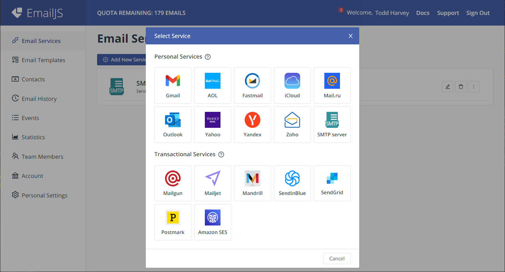
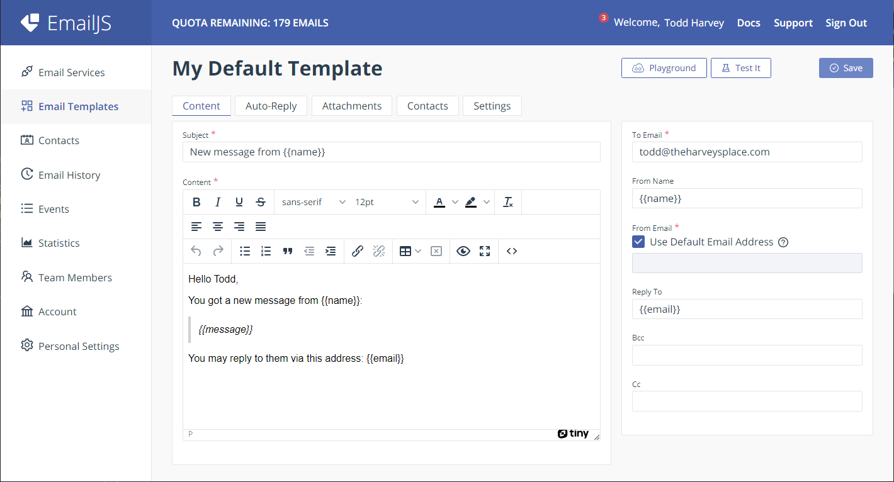

# React Contact Form

## Description
This project is a contact form built with React. It sends emails with EmailJS instead of needing a back end. EmailJS is a third-party service that allows you to send up to 200 emails per month for free.

## Setting Up EmailJS
First go to <https://dashboard.emailjs.com/sign-up> and create a free account.

Once your account is created, click on the **Email Services** link on the navigation menu and choose which service you would like to use.

Then go to the **Email Templates** link and click **Create New Template**. Update the template to contain the information and styling you would like to receive in your emails. The items in double curly brackets (`{{}}`) should match the variables from your React app code  (e.g., {{name}}, {{email}}, {{message}}).

## More info pending...

## Contact Info
Email: todd@theharveysplace.com

## License
Copyright (c) 2021 Todd Harvey

Permission to use, copy, modify, and/or distribute this software for any purpose with or without fee is hereby granted, provided that the above copyright notice and this permission notice appear in all copies.

THE SOFTWARE IS PROVIDED "AS IS" AND THE AUTHOR DISCLAIMS ALL WARRANTIES WITH REGARD TO THIS SOFTWARE INCLUDING ALL IMPLIED WARRANTIES OF MERCHANTABILITY AND FITNESS. IN NO EVENT SHALL THE AUTHOR BE LIABLE FOR ANY SPECIAL, DIRECT, INDIRECT, OR CONSEQUENTIAL DAMAGES OR ANY DAMAGES WHATSOEVER RESULTING FROM LOSS OF USE, DATA OR PROFITS, WHETHER IN AN ACTION OF CONTRACT, NEGLIGENCE OR OTHER TORTIOUS ACTION, ARISING OUT OF OR IN CONNECTION WITH THE USE OR PERFORMANCE OF THIS SOFTWARE.